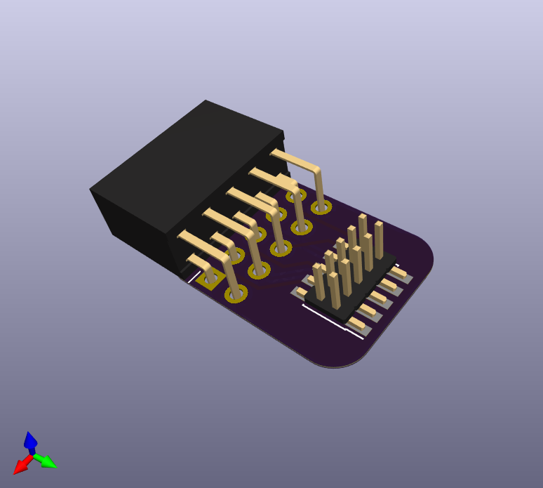
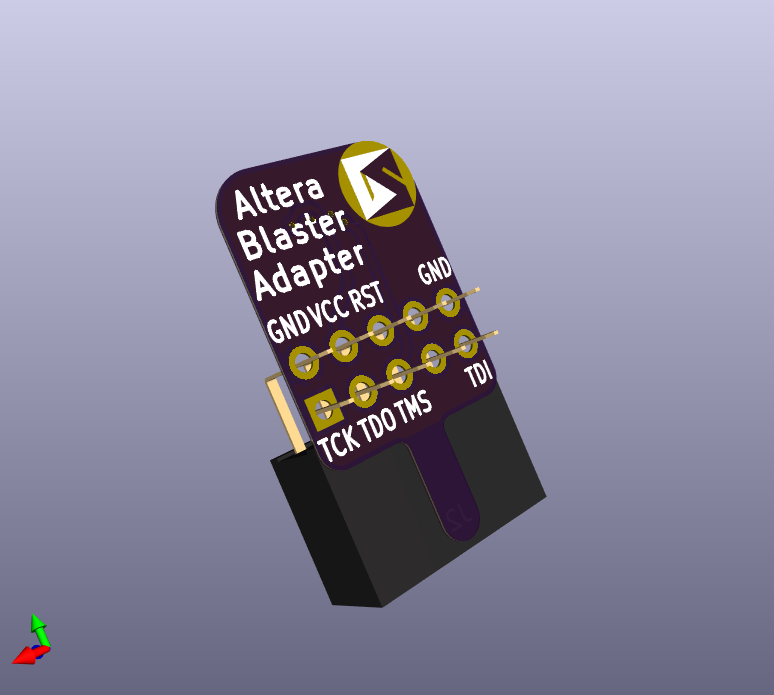
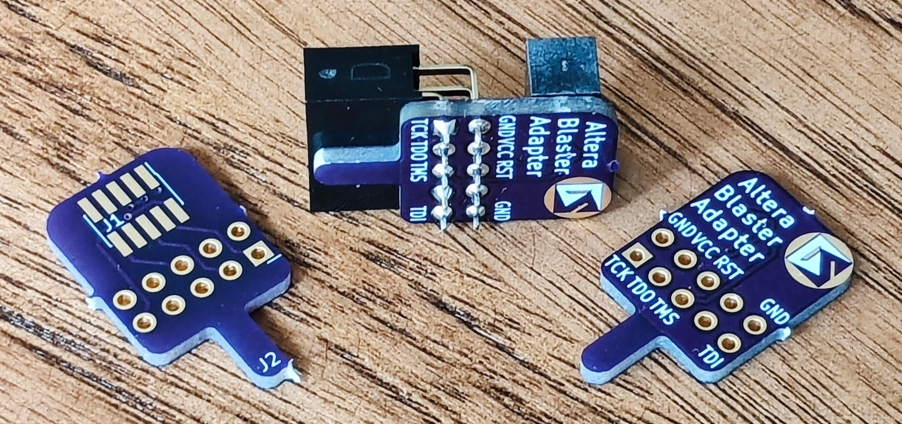

# Arm Cortex SWD Header to Altera Blaster Adapter

This design adapts the 10 pin 50 mil picth JTAG header pinout used by Arm to the 10 pin 100 mil pitch header pinout used by Altera for their Blasters.  It works great with the [Tigard board](https://www.crowdsupply.com/securinghw/tigard) and [openFPGALoader](https://github.com/trabucayre/openFPGALoader).

You can [order the PCB inexpensively from OSH Park](https://oshpark.com/shared_projects/WjwHzZBt).
I've included [a PDF version of the schematic](swd-blaster.pdf) for convenience.

Here is the board being used to connect Tigard to the MAX10 10M08 Evaluation Kit:
![Tigard board connected to 10M08EVK using SWD-Blaster adapter)(./img/max10m08-swd-adapter-tigard.jpg)

Here are some additional images of the board:

